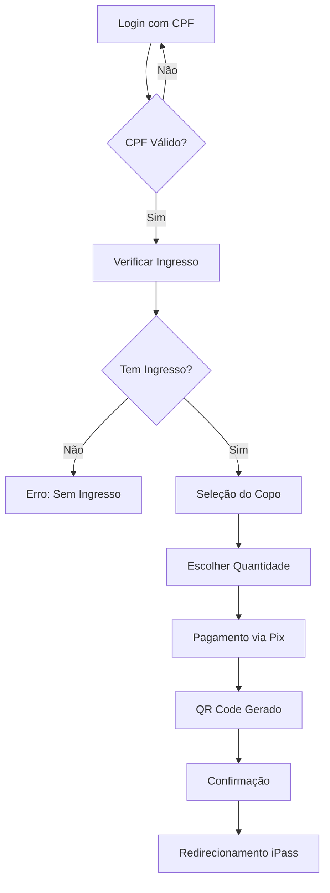

# 🎪 iPass Copos - STL Festival 2025

Sistema de venda de copos oficiais do STL Festival 2025 com verificação por CPF e pagamento via Pix.

## 🎯 **Visão Geral**

O **iPass Copos** é uma aplicação web desenvolvida para facilitar a venda do copo oficial do STL Festival 2025. O sistema permite que portadores de ingresso adquiram o copo de forma digital, sem filas e com verificação simples por CPF.

### ✨ **Funcionalidades Principais**

- 🔐 **Login por CPF** - Verificação simples sem senha
- 🏆 **Seleção do Copo** - Produto único com opções de quantidade
- 💳 **Pagamento via Pix** - QR Code gerado automaticamente
- ✅ **Confirmação** - Redirecionamento para o app iPass

## 🏗️ **Arquitetura**

### **Stack Tecnológica**

- **Frontend**: React 18 + TypeScript
- **Framework**: Next.js 14 (App Router)
- **Estilização**: Tailwind CSS
- **Formulários**: React Hook Form
- **Validação**: Validação de CPF nativa
- **QR Code**: qrcode library
- **Backend**: Será desenvolvido pela Scooder
- **Banco de Dados**: MongoDB (Scooder)

### **Estrutura do Projeto**

```
ipass-copos/
├── app/                    # App Router do Next.js
│   ├── layout.tsx         # Layout principal
│   └── page.tsx           # Página inicial
├── src/
│   ├── components/        # Componentes React
│   │   ├── ui/           # Componentes base (Button, Input, Card)
│   │   └── screens/      # Telas da aplicação
│   ├── hooks/            # Hooks customizados
│   ├── utils/            # Utilitários (CPF, moeda, etc.)
│   ├── types/            # Tipos TypeScript
│   └── styles/           # Estilos globais
├── public/               # Arquivos estáticos
└── docs/                 # Documentação
```

## 🚀 **Instalação e Execução**

### **Pré-requisitos**

- Node.js 18+ 
- npm ou yarn

### **Instalação**

```bash
# Clone o repositório
git clone https://github.com/seu-usuario/ipass-copos.git
cd ipass-copos

# Instale as dependências
npm install

# Execute em modo de desenvolvimento
npm run dev
```

### **Scripts Disponíveis**

```bash
npm run dev        # Desenvolvimento
npm run build      # Build para produção
npm run start      # Execução em produção
npm run lint       # Verificação de código
npm run lint:fix   # Correção automática
npm run type-check # Verificação de tipos
```

## 🎨 **Design System**

### **Cores**

- **Primary**: Azul (#2563eb) - Ações principais
- **Secondary**: Verde (#16a34a) - Confirmações
- **Accent**: Amarelo (#eab308) - Destaques

### **Componentes**

- **Button**: Variações (primary, secondary, outline, ghost)
- **Input**: Com validação e estados de erro
- **Card**: Container flexível para conteúdo

## 🔄 **Fluxo da Aplicação**



## 🧪 **Validações**

### **CPF**
- Algoritmo oficial de validação
- Formatação automática (000.000.000-00)
- Verificação de dígitos verificadores

### **Formulários**
- Validação em tempo real
- Mensagens de erro contextuais
- Estados de loading

## 🔗 **Integração com Backend**

> **Nota**: O backend será desenvolvido pela equipe Scooder

### **Endpoints Esperados**

```typescript
// Verificação de CPF e ingresso
POST /api/auth/verify-cpf
{
  "cpf": "12345678901"
}

// Criação de pedido
POST /api/orders
{
  "userId": "cpf",
  "cupId": "stl-2025-official-cup",
  "quantity": 1
}

// Geração de Pix
POST /api/payments/pix
{
  "orderId": "order-id",
  "amount": 2500 // em centavos
}
```

## 📱 **Responsividade**

- **Mobile First**: Otimizado para dispositivos móveis
- **Breakpoints**: sm (640px), md (768px), lg (1024px)
- **Touch Friendly**: Botões e áreas de toque adequadas

## 🔒 **Segurança**

- Validação de CPF no frontend e backend
- Não armazenamento de dados sensíveis
- Headers de segurança configurados
- Prevenção de zoom em iOS

## 🚀 **Deploy**

### **Vercel (Recomendado)**

```bash
# Instalar Vercel CLI
npm i -g vercel

# Deploy
vercel --prod
```

### **Outras Plataformas**

- **Netlify**: Suporte nativo ao Next.js
- **AWS Amplify**: Deploy automático
- **Docker**: Dockerfile incluído

## 🧑‍💻 **Desenvolvimento**

### **Padrões de Código**

- **ESLint**: Configuração Next.js + TypeScript
- **Prettier**: Formatação automática
- **Conventional Commits**: Padrão de commits
- **TypeScript Strict**: Tipagem rigorosa

### **Estrutura de Componentes**

```typescript
// Exemplo de componente
interface ComponentProps {
  // Props tipadas
}

export function Component({ ...props }: ComponentProps) {
  // Lógica do componente
  return (
    // JSX
  );
}
```

## 📊 **Performance**

- **Core Web Vitals**: Otimizado para métricas do Google
- **Bundle Size**: Minimizado com tree-shaking
- **Images**: Otimização automática do Next.js
- **Fonts**: Carregamento otimizado

## 🤝 **Contribuição**

1. Fork o projeto
2. Crie uma branch (`git checkout -b feature/nova-funcionalidade`)
3. Commit suas mudanças (`git commit -m 'feat: adiciona nova funcionalidade'`)
4. Push para a branch (`git push origin feature/nova-funcionalidade`)
5. Abra um Pull Request

## 📄 **Licença**

Este projeto está sob a licença MIT. Veja o arquivo [LICENSE](LICENSE) para detalhes.

## 👥 **Equipe**

- **Frontend**: Sua equipe
- **Backend & Integração**: Scooder
- **Design**: STL Festival Team

## 📞 **Suporte**

Para dúvidas ou suporte:
- 📧 Email: suporte@stlfestival.com
- 💬 Slack: #ipass-copos
- 📱 WhatsApp: (11) 99999-9999

---

**STL Festival 2025** - Transformando experiências através da tecnologia 🎪✨