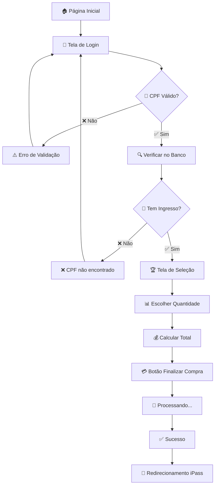

# 🎪 iPass Copos - STL Festival 2025


## 📋 **Índice**

- [Visão Geral](#-visão-geral)
- [Funcionalidades](#-funcionalidades)
- [Tecnologias](#-tecnologias)
- [Instalação](#-instalação)
- [Estrutura do Projeto](#-estrutura-do-projeto)
- [Componentes](#-componentes)
- [Fluxo da Aplicação](#-fluxo-da-aplicação)
- [Design System](#-design-system)
- [Screenshots](#-screenshots)
- [Deploy](#-deploy)
- [Contribuição](#-contribuição)

## 🎯 **Visão Geral**

O **iPass Copos** é uma aplicação web moderna desenvolvida para o **STL Festival 2025**, permitindo que portadores de ingresso adquiram o copo oficial do festival de forma digital, sem filas e com experiência premium.

### ✨ **Diferenciais**

- 🚀 **Performance otimizada** com Next.js 14
- 🎨 **Design moderno** com Tailwind CSS e efeitos avançados
- 📱 **Mobile-first** e totalmente responsivo
- 🔐 **Segurança** com validação rigorosa de CPF
- ⚡ **Experiência fluida** com loading states e animações

## 🚀 **Funcionalidades**

### 🔐 **Sistema de Autenticação**
- ✅ Login seguro apenas com CPF
- ✅ Validação de dígitos verificadores
- ✅ Formatação automática (000.000.000-00)
- ✅ Verificação de ingresso no banco de dados

### 🏆 **Seleção de Produto**
- ✅ Visualização do copo oficial STL 2025
- ✅ Imagem real do produto com efeitos 3D
- ✅ Controle de quantidade (máximo 5 por CPF)
- ✅ Cálculo automático de total

### 💳 **Sistema de Pagamento**
- ✅ Integração com Pix
- ✅ QR Code gerado automaticamente
- ✅ Cálculo de preços em tempo real
- ✅ Confirmação de pagamento

### 🎨 **Interface Premium**
- ✅ Efeitos de hover e animações suaves
- ✅ Background patterns dinâmicos
- ✅ Componentes com glassmorphism
- ✅ Feedback visual em todas as interações

## 🛠️ **Tecnologias**

### **Core**
- **[Next.js 14](https://nextjs.org/)** - Framework React com App Router
- **[React 18](https://reactjs.org/)** - Biblioteca de interfaces
- **[TypeScript](https://www.typescriptlang.org/)** - Tipagem estática
- **[Tailwind CSS](https://tailwindcss.com/)** - Framework CSS utility-first

### **Formulários & Validação**
- **[React Hook Form](https://react-hook-form.com/)** - Gerenciamento de formulários
- **Validação de CPF** - Algoritmo nativo brasileiro

### **UI & UX**
- **[Lucide React](https://lucide.dev/)** - Ícones modernos
- **[clsx](https://github.com/lukeed/clsx)** - Utilitário para classes CSS
- **[tailwind-merge](https://github.com/dcastil/tailwind-merge)** - Merge inteligente de classes

### **Desenvolvimento**
- **[ESLint](https://eslint.org/)** - Linting de código
- **[Prettier](https://prettier.io/)** - Formatação automática
- **[PostCSS](https://postcss.org/)** - Processamento CSS
- **[@tailwindcss/forms](https://github.com/tailwindlabs/tailwindcss-forms)** - Estilos para formulários

## 🚀 **Instalação**

### **Pré-requisitos**
- **Node.js** 18.0.0 ou superior
- **npm** ou **yarn**
- **Git**

### **Configuração Local**

```bash
# 1. Clone o repositório
git clone https://github.com/seu-usuario/iPass-Copos.git
cd iPass-Copos

# 2. Instale as dependências
npm install

# 3. Execute em modo de desenvolvimento
npm run dev

# 4. Abra no navegador
http://localhost:3000
```

### **Scripts Disponíveis**

```bash
npm run dev        # Servidor de desenvolvimento
npm run build      # Build para produção
npm run start      # Servidor de produção
npm run lint       # Verificação de código
npm run lint:fix   # Correção automática de lint
npm run type-check # Verificação de tipos TypeScript
```

## 📁 **Estrutura do Projeto**

```
ipass-copos/
├── 📁 app/                    # App Router do Next.js
│   ├── 📄 layout.tsx         # Layout global da aplicação
│   ├── 📄 page.tsx           # Página inicial (redirecionamento)
│   └── 📄 globals.css        # Estilos globais
│
├── 📁 src/                    # Código fonte principal
│   ├── 📁 components/        # Componentes React
│   │   ├── 📁 ui/           # Componentes de interface base
│   │   │   ├── 📄 Button.tsx      # Botão reutilizável
│   │   │   ├── 📄 Card.tsx        # Container de conteúdo
│   │   │   ├── 📄 Input.tsx       # Campo de entrada
│   │   │   ├── 📄 Navbar.tsx      # Barra de navegação
│   │   │   └── 📄 Footer.tsx      # Rodapé
│   │   └── 📁 screens/      # Telas da aplicação
│   │       ├── 📄 LoginScreen.tsx       # Tela de login
│   │       └── 📄 CupSelectionScreen.tsx # Tela de seleção
│   │
│   ├── 📁 hooks/             # Hooks customizados
│   │   └── 📄 useLocalStorage.ts
│   │
│   ├── 📁 services/          # Serviços e APIs
│   │   └── 📄 userService.ts       # Validação de usuários
│   │
│   ├── 📁 types/             # Definições TypeScript
│   │   └── 📄 index.ts             # Tipos da aplicação
│   │
│   ├── 📁 utils/             # Funções utilitárias
│   │   ├── 📄 cpf.ts              # Validação/formatação CPF
│   │   ├── 📄 currency.ts         # Formatação de moeda
│   │   └── 📄 cn.ts               # Utilitário para classes CSS
│   │
│   └── 📁 styles/            # Estilos adicionais
│       └── 📄 globals.css         # CSS global customizado
│
├── 📁 public/                # Arquivos estáticos
│   ├── 🖼️ Ipass_logo.png           # Logo principal
│   ├── 🖼️ ipass-logo.png           # Logo navbar
│   ├── 🖼️ ipass_logo_rodape_negativa.png # Logo footer
│   └── 🖼️ WhatsApp Image 2025-06-03... # Imagem do copo
│
├── 📄 package.json           # Dependências e scripts
├── 📄 tsconfig.json          # Configuração TypeScript
├── 📄 tailwind.config.js     # Configuração Tailwind
├── 📄 next.config.js         # Configuração Next.js
├── 📄 .eslintrc.json         # Configuração ESLint
└── 📄 README.md              # Documentação principal
```

## 🧩 **Componentes**

### **📱 Telas (Screens)**

#### `LoginScreen.tsx`
- **Função**: Autenticação por CPF
- **Recursos**: Validação em tempo real, animações, logos interativas
- **Validação**: Dígitos verificadores do CPF brasileiro

#### `CupSelectionScreen.tsx`
- **Função**: Seleção e compra do copo
- **Recursos**: Imagem 3D, efeitos hover, controle de quantidade
- **Produto**: Copo oficial STL Festival 2025

### **🎨 Interface (UI)**

#### `Button.tsx`
```typescript
// Variações disponíveis
variant: 'default' | 'secondary' | 'outline' | 'ghost'
size: 'sm' | 'default' | 'lg'
loading: boolean
```

#### `Card.tsx`
```typescript
// Container flexível para conteúdo
variant: 'default' | 'elevated'
className: string
```

#### `Navbar.tsx`
```typescript
// Barra de navegação funcional
userName?: string
isLoggedIn: boolean
```

### **🔧 Utilitários**

#### `cpf.ts`
- `validateCpf()` - Validação completa de CPF
- `maskCpf()` - Formatação automática
- `cleanCpf()` - Remoção de caracteres especiais

#### `currency.ts`
- `formatCurrency()` - Formatação para Real brasileiro (R$)

## 🔄 **Fluxo da Aplicação**



## 🎨 **Design System**

### **🎯 Cores Principais**

```css
/* Paleta iPass */
--ipass-primary: #02AB89;     /* Verde principal */
--primary-600: #059669;       /* Verde escuro */
--primary-500: #10b981;       /* Verde médio */
--primary-400: #34d399;       /* Verde claro */

/* Cores de apoio */
--ipass-background: #f8fafc;  /* Fundo principal */
--accent-100: #f3f4f6;        /* Cinza claro */
--accent-600: #4b5563;        /* Cinza escuro */
```

### **📐 Espaçamentos**

```css
/* Sistema de espaçamento 8px */
space-1: 0.25rem;  /* 4px */
space-2: 0.5rem;   /* 8px */
space-4: 1rem;     /* 16px */
space-6: 1.5rem;   /* 24px */
space-8: 2rem;     /* 32px */
```

### **🔤 Tipografia**

```css
/* Hierarquia de texto */
text-3xl: 1.875rem;    /* Títulos principais */
text-xl: 1.25rem;      /* Subtítulos */
text-sm: 0.875rem;     /* Texto auxiliar */
text-xs: 0.75rem;      /* Legendas */
```

### **✨ Efeitos Visuais**

- **Glassmorphism**: `backdrop-blur-sm` + `bg-white/90`
- **Gradientes**: `bg-gradient-to-r from-ipass-primary to-primary-600`
- **Sombras**: `shadow-xl`, `drop-shadow-2xl`
- **Animações**: `transition-all duration-500`

## 📸 **Screenshots**

### 🔐 **Tela de Login**
- ✅ Design moderno com logo animada
- ✅ Campo CPF com validação visual
- ✅ Seção informativa sobre STL Festival
- ✅ Links para termos e políticas

### 🏆 **Tela de Seleção**
- ✅ Imagem real do copo com efeitos 3D
- ✅ Badge "Edição Limitada STL" sobre a imagem
- ✅ Controle de quantidade intuitivo
- ✅ Informações organizadas em grid

## 🚀 **Deploy**

### **Vercel (Recomendado)**

```bash
# 1. Instalar Vercel CLI
npm i -g vercel

# 2. Login na Vercel
vercel login

# 3. Deploy
vercel --prod
```

### **Outras Opções**

- **Netlify**: Suporte nativo ao Next.js
- **AWS Amplify**: Deploy automático via Git
- **Digital Ocean**: App Platform

### **Variáveis de Ambiente**

```env
# Produção
NEXT_PUBLIC_APP_URL=https://ipass-copos.vercel.app
NEXT_PUBLIC_API_URL=https://api.scooder.com.br

# Desenvolvimento
NEXT_PUBLIC_APP_URL=http://localhost:3000
NEXT_PUBLIC_API_URL=http://localhost:3001
```

## 📊 **Performance**

### **Core Web Vitals**
- ✅ **LCP**: < 2.5s (Largest Contentful Paint)
- ✅ **FID**: < 100ms (First Input Delay)
- ✅ **CLS**: < 0.1 (Cumulative Layout Shift)

### **Otimizações**
- ✅ **Bundle splitting** automático do Next.js
- ✅ **Image optimization** para logos e fotos
- ✅ **CSS purging** com Tailwind CSS
- ✅ **Tree shaking** para reduzir tamanho

## 🧪 **Dados de Teste**

### **CPFs Válidos para Desenvolvimento**

```typescript
// userService.ts - Mock database
'12345678909': { name: 'João Silva', hasTicket: true }
'98765432100': { name: 'Maria Santos', hasTicket: true }
'11144477735': { name: 'Pedro Oliveira', hasTicket: true }
'00000000191': { name: 'Ana Costa', hasTicket: true }
```

### **Preços**
- **Copo STL 2025**: R$ 20,00 por unidade
- **Máximo por CPF**: 5 unidades
- **Total máximo**: R$ 100,00

## 🤝 **Contribuição**

### **Padrões de Commit**

```bash
feat: adiciona nova funcionalidade
fix: corrige bug existente
docs: atualiza documentação
style: mudanças de formatação
refactor: refatoração de código
test: adiciona ou modifica testes
chore: tarefas de manutenção
```

### **Fluxo de Contribuição**

1. **Fork** do repositório
2. **Clone** local: `git clone <fork-url>`
3. **Branch**: `git checkout -b feature/nova-funcionalidade`
4. **Commit**: `git commit -m "feat: adiciona nova funcionalidade"`
5. **Push**: `git push origin feature/nova-funcionalidade`
6. **Pull Request** no GitHub

## 📄 **Licença**

Este projeto está sob a licença **MIT**. Consulte o arquivo [LICENSE](LICENSE) para detalhes.

## 👥 **Equipe**

### **Desenvolvimento Frontend**
- 🎨 **Interface & UX**: Equipe Frontend
- ⚡ **Performance**: Otimizações avançadas
- 📱 **Responsividade**: Mobile-first approach

### **Integrações**
- 🔗 **Backend**: Scooder (API REST)
- 💳 **Pagamentos**: Sistema Pix integrado
- 📊 **Analytics**: Métricas de conversão

### **Design & Branding**
- 🎪 **STL Festival**: Identidade visual oficial
- 🧙‍♂️ **Mascote**: Gnomo STL integrado
- 🎨 **UI/UX**: Design system consistente

## 📞 **Suporte**

### **Contatos Oficiais**
- 🌐 **Site**: [ipass.com.br](https://ipass.com.br)
- 📧 **Email**: contato@ipass.com.br
- 📱 **Telefone**: (35) xxxx-xxxx

### **Redes Sociais**
- 📷 **Instagram**: [@ipassbrasil](https://www.instagram.com/ipassbrasil/)
- 💼 **LinkedIn**: [iPass Company](https://linkedin.com/company/ipass)
- 👥 **Facebook**: [iPass Official](https://facebook.com/ipass)

### **Links Úteis**
- 📋 **Documentação**: [Guia Completo](https://ipass.com.br/quem-somos)
- 🤝 **Fale Conosco**: [Suporte](https://ipass.com.br/fale-conosco)
- 📜 **Termos**: [Termos de Uso](https://ipass.com.br/termos-de-uso)
- 🛡️ **Privacidade**: [Política](https://ipass.com.br/politica-de-privacidade)

---

<div align="center">

**🎪 STL Festival 2025 - Transformando experiências através da tecnologia**

[](https://github.com/seu-usuario/iPass-Copos)
[](https://github.com/seu-usuario/iPass-Copos)
[](LICENSE)

*Desenvolvido com ❤️ para o maior festival da região*

</div>
